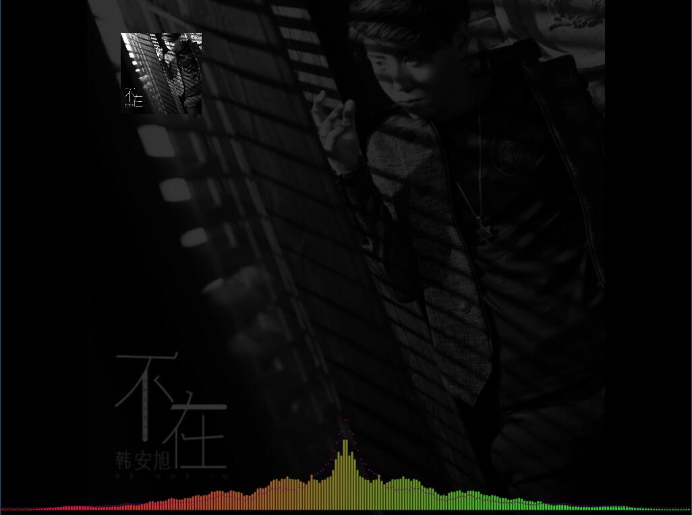
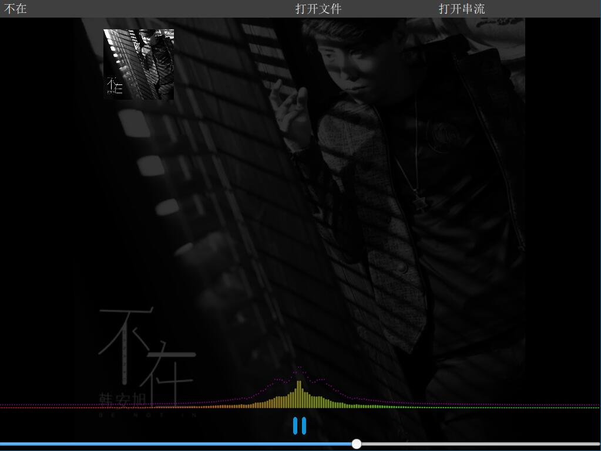

# FQFLib
## FQFLib V2.0 [fqflib.zuozl.com](http://fqflib.zuozl.com).
* 基于FFmpeg的多媒体、流媒体（Rtsp/Rtmp）Qt/C++播放库。
	* 支持格式：
		* 文件：mp4、wmv、mov、flac、mp3等，其余格式跳转功能需要简单修改源码。
		* 流：rtsp、rtmp、hls
	* 支持功能：
		* 播放
		* 跳转
		* 暂停
		* 获取媒体信息（时长、尺寸等）
		* 过程信息
	* 项目文档：
		* [fqflib.zuozl.com/doc](http://fqflib.zuozl.com/index.php/document/)；
		* 文档制作中，稍后即可访问；
		* 对应头文件中均有详细介绍。
	* 目录介绍：
		* src->Qt版本源码，直接添加pri文件到工程即可使用，请在pri文件配置本地FFmpeg目录；
		* sample->项目示例。
	* 使用说明：
		* 需要一定的共享库使用基础，项目中配置对应的链接目录、头文件目录即可；
		* 对应不同平台需要实现音视频对应的驱动，继承项目中的FQFAudioDevice与FQFVideoDevice类完成即可；
		* FQFVideoDevice writeToBuffer传入的数据格式为BRGA；
		* 将对应的对象指针通过FQFDemuxThread构造函数传入即可；
		* FQFDemuxThread为顶层操作类，实例化该类即可完成对应功能；
		* sample中有qt音频播放驱动及qtquick视频（图片）传递驱动示例。
		* 使用ffmpeg 4.1完成，运行时需要具有ffmpeg对应的DLL文件，并放入exe所在的文件夹或配置环境变量

## FQFLib应用示例
* [FQFPlayer:Github/zuozhulin88/FQFPlayer](https://github.com/zuozhulin88/FQFPlayer)
* 展示

